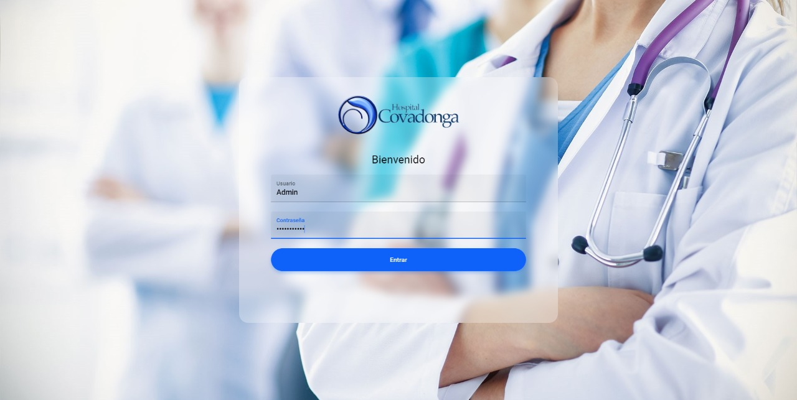

#Hackathon Covadonga 2021

# Poblemática: 
En nuestra vida cotidiana los servicios de salud son sin pensarlo los primeros, nuestra vida no tiene precio, que incluye desde la salud, nuestro bienestar y familiares.

En la actualidad muchas de las personas que asisten a sus consultas medicas tiene que realizar una fila para poder agendar y ser atendidos, aunque por la afluencia de muchas personas en ese luagres o por necesidad la cantidad de citas por parte de los centros medicos no son suficientes. 

En que afecta a las personas: 
- Tiempo: Las personas al transladarse a dichos lugares para poder acceder a una cita medica dejan de atender sus actividades cotidianas o personales para espera en las filas ya creadas, esto oaciona hasta cierto punto la perdida de tiempo sí no se alcanza a agendar una cita. 
- Economia: Las personas para asistir deberán de pagar transporte desde su casa hasta los hospitales. 
- Salud: Algúnas de las personas que asisten su principal motivo es atender algún problema de salud que esta en ese momento atacando al paciente y es necesario su intervecnión, aunque no se pueda agendar se deberá de esperar. 
- Clima: Al asistir a los centros medicos para la agendar una cita, muchas de las veces los centros no cuentan con espacio techado para espera y se tiene que realizar en zona publica, calles o banquetas. 

# Solución:
Generar un sistema digital donde se puedan almacenar las citas y que las personas (usuarios) puedan crear su perfil y ellos mismo poder generar una cita a travez de una app movil, (par este caso). 

Ademas un sistema web para el control de las citas que los usuarios generaron y poder asignar la prioridad en su momento y ser atendidos en las fechas seleccionadas. 

Una aplicación móvil para el sistema de hambulancias donde los paramedicos puedan llenar los datos del pacinte que esta atendiendo. 

https://github.com/JamesHR/Hackathon_covadonga_2021/blob/main/assets/web/01.jpeg

