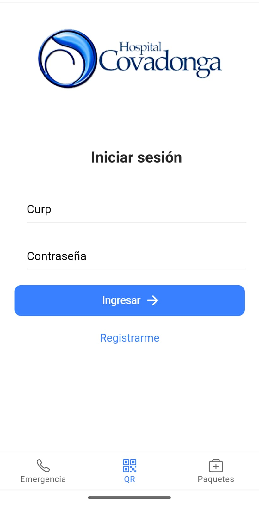
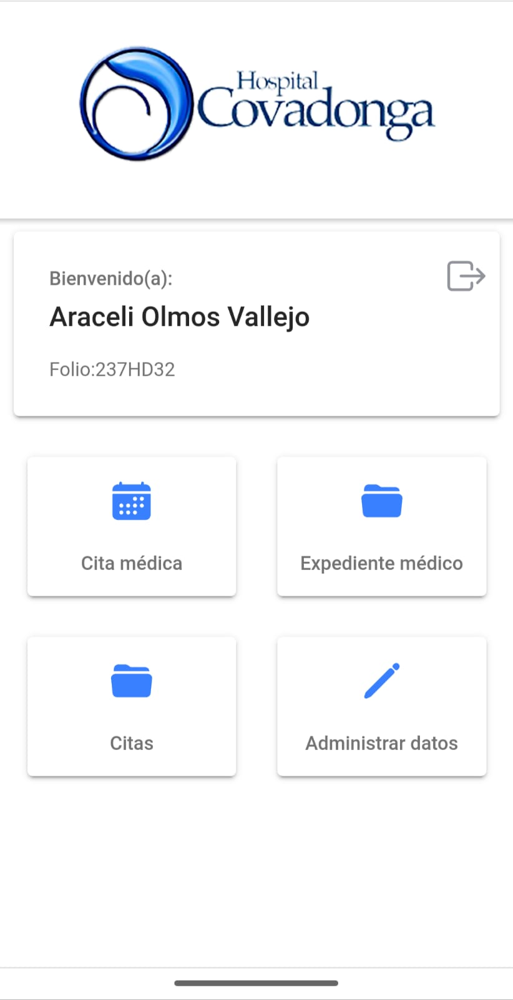
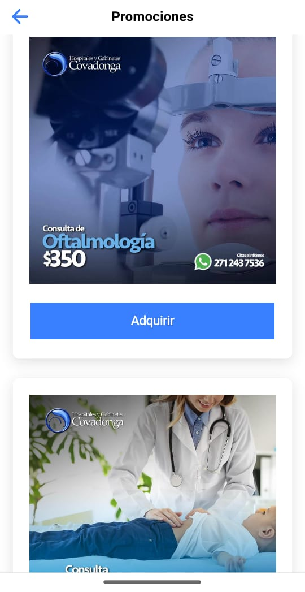
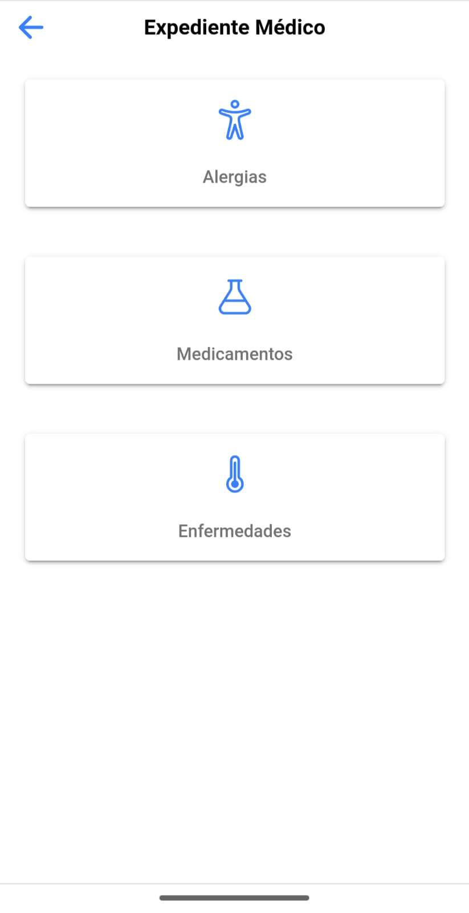

# Poblemática: 
En nuestra vida cotidiana los servicios de salud son sin pensarlo los primeros, nuestra vida no tiene precio, que incluye desde la salud, nuestro bienestar y familiares.

En la actualidad muchas de las personas que asisten a sus consultas medicas tiene que realizar una fila para poder agendar y ser atendidos, aunque por la afluencia de muchas personas en ese luagres o por necesidad la cantidad de citas por parte de los centros médicos no son suficientes. 

### En que afecta a las personas: 
- Tiempo: Las personas al transladarse a dichos lugares para poder acceder a una cita medica dejan de atender sus actividades cotidianas o personales para espera en las filas ya creadas, esto ocaciona hasta cierto punto la perdida de tiempo sí no se alcanza a agendar una cita. 
- Economía: Las personas para asistir deberán de pagar transporte desde su casa hasta los hospitales. 
- Salud: Algúnas de las personas que asisten su principal motivo es atender algún problema de salud que esta en ese momento atacando al paciente y es necesario su intervecnión, aunque no se pueda agendar se deberá de esperar. 
- Clima: Al asistir a los centros medicos para la agendar una cita, muchas de las veces los centros no cuentan con espacio techado para espera y se tiene que realizar en zona publica, calles o banquetas. 

# Solución:
Generar un sistema digital donde se puedan almacenar las citas y que las personas (usuarios) puedan crear su perfil y ellos mismo poder generar una cita a travez de una app movil, (para este caso). 

Además un sistema web para el control de las citas que los usuarios generaron y poder asignar la prioridad en su momento y ser atendidos en las fechas seleccionadas. 

Una aplicación móvil para el sistema de ambulancias donde los paramédicos puedan llenar los datos del paciente que esta atendiendo. 

# Propuesta:
A continuación, se describen los tipos de productos que engloba el proyecto realizado, constando de 3 principales:

El ecosistema de aplicaciones se basa en las siguiente:

## Aplicación Móvil para el usuario:
App movil enficada a los usuarios para que puedan crear un perfil, para esto es necesario ingresar datos basicos, el usuario es libre de ingresar los datos, aunque si es obligatorio su nombre, correo y contraseña para tener un perfil básico. 

Una vez tengan su perf

Una vez registrado deberá podrá acceder a su panel de control donde se le solicitará que acepte los terminos y condiciones del sistema como privacidad de datos, seguido su panel principal.

Si el usuario lo prefiere puede contratar alguno de sus paquetes que el hospital de Covadonga oferta a sus clientes. 

El usuario podrá en algun momento agregar mas información reelevante, como su estado de salud, medicamentos, alegias, enfermedades y otros. esto completará su perfil y será mas facil saber de la persona.

## Aplicación Web:

Sistema Seb para el control de las citas que se agendan desde la App Móvil y poder atenderlas en su momento, en ella se pueden asignar las prioridades en cada una de ella. Si es necesario eliminarlas o marcar como: [Atendiendo, en Espera, Finalizada]. 

Además de controlar los estados de las ambulancias, las urgencias y su forma de operar cuando se presenta una urgencia en el sistema. 

A continuación, se describen las interfaces del sistema.

Formulario para la validación de credenciales de usuario y poder acceder al sistema

Y poder ver los registros de las citas ya agendadas

## Aplicación Movil para los Paramedicos

Se pueden obtener datos del paciente que esta siendo tratado desde la ambulancia. 

Con el apoyo del ecosistema propuesto se pueden escanear un codigo QR de la anterior aplicación, y asi apoyar en el llenado del formato `Prehospitalario` y agilizar el proceso de levantado de datos.

